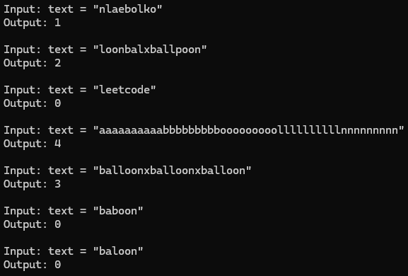

### LeetCode #1189. Maximum Number of Balloons
Given a string `text`, you want to use the characters of `text` to form as many instances of the word **"balloon"** as possible.

You can use each character in `text` at most once. Return the maximum number of instances that can be formed.

---
### Example 1:

```
Input: text = "nlaebolko"
Output: 1
```
---
### Example 2:

```
Input: text = "loonbalxballpoon"
Output: 2
```
---
### Example 3:
```
Input: text = "leetcode"
Output: 0
```
---
### Code Output:

